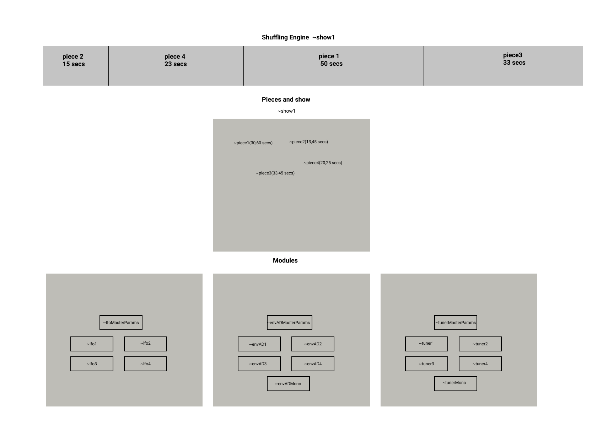

- [**Radio Crawler Overview**](#radio-crawler-overview)
- [**Installation**](#installation)
- [**Structure**](#structure)
- [**Modules Reference**](#modules-reference)
  - [**~envAD arguments**](#envad-arguments)
  - [**~lfo arguments**](#lfo-arguments)
  - [**~tuner arguments**](#tuner-arguments)
  - [**~limiter**](#limiter)
- [**Pieces reference**](#pieces-reference)
  - [**Piece commands**](#piece-commands)
  - [**Compiling shows from pieces**](#compiling-shows-from-pieces)
- [**Shuffling engine reference**](#shuffling-engine-reference)
# **Radio Crawler Overview**

Welcome to the Radio Crawler documentation! Radio Crawler is a system that allows the user to algorithmically control 4 unique instances of the Wide-band WebSDR page http://websdr.ewi.utwente.nl:8901. Through the page you can control and listen to a short-wave radio receiver located at the amateur radio club ETGD at the University of Twente. Essentially, Radio Crawler is a framework for creating algorithmic sound pieces using live shortwave radio transmissions.

Radio Crawler let's you control the radio receiver's frequency and modulation: scan a frequency range randomly or linearly, create loops, shuffle and repeat lists, randomly play a list of frequencies and modes. 

Radio Crawler let's you control the volume envelope of each radio instance independantly: Create fades, short events, long events, sparse or dense sonic environments, thick layers or contrapuntal textures.

Radio Crawler  let's you organise your radio pieces and shuffle them creating long-form works.

# **Installation**

Radio Crawler requires the newest version of node.js, Supercollider and a source code editor.

get node.js: https://nodejs.org/en/

get Supercollider: https://supercollider.github.io/download

get Visual Studio Code: https://code.visualstudio.com

download Radio Crawler:

Inside the Radio_Crawler_Master folder open the node_script folder with a source code editor. Open a terminal and type: `npm i`

All required dependancies will be installed. One of the dependencies is the chromium browser so it may take a while to finish.

To start the radio engine type on the terminal: `npm start` or `node radio.js` **be aware of the volume**

At this point the chromium browser should automatically run with 4 tabs of the http://websdr.ewi.utwente.nl:8901 website. 

Open the radio_crawler_main.scd file with supercollider and evaluate the code using ctrl (cmd) + enter. Some example pieces should start playing. You can monitor Radio Crawler's activity on the post window. You can stop all activity and mute the radios by evaluating ```~mute.value;``` on line 46 of radio_crawler_main. You can also use the shortcut ctrl + . (period).  


# **Structure**

Radio Crawler is using the puppeteer node library to assume control of the WebSDR parameters. The supercollider programs are algorithmically controlling the parameters by sending OSC data to the node script. Radio Crawler works on data control level, the audio produced is solely from the webpage.  

Radio Crawler is based on three different structural levels. The modules (modules.scd), the pieces (pieces.scd) and the shuffle engine (radio_crawler_main.scd). 

The modules contains the building blocks that are used to create pieces. Currently those are:

* ```~tuner```: Controls the modulation mode and frequency of the radios

* ```~envAD```: A simple on/off style volume envelope

* ```~lfo```: A continuous LFO style volume envelope

A piece is a collection of timed events, akin to a music tracker. These events can be: 

* starting and stopping modules   
* changing the parameters of modules

Each piece will last for a specific duration which is expressed by a random durational range (see pieces reference).

The shuffle engine collects the list of pieces and plays them in a non-repeating fashion. 





# **Modules Reference**

Each module has 4 seperate and independant instances (voices) denoted by the numbers 1-4.

Each module's parameters can be altered by recalling the Params function.

The Params function can be recalled with the name of the module, number of voice and Params affix followed by the `.value([])` method with arguments inside the brackets:
`~lfo1Params.value([[5, 10, 1, 8, 3, 7],0,\lin]);`

The ~tuner and ~envAD modules have a mono function as well, which is denoted as "Mono" in place of the voice number:

```~tunerMono; ~envADMono;```.

You can control the parameters for every voice at once using the MasterParams function. e.g.
`
~tunerMasterParams.value([]);
`
You can start and stop every module outside the context of pieces by using the suffix Pat:

```js
lfo1Pat.play; 
lfo1Pat.stop;
tuner3Pat.play;
tuner3Pat.stop;
```
etc.

## **~envAD arguments**

1. **rate type** (symbol):
```js
\const // constant rate
\rand  // random rate
\drunk // random walk
\dec   // decelerration
\acc   // acceleration
```
2. **staccato-legato** (symbol) :

```js
\long  // envelope is on for the full duration 
\short // envelope is off for half the duration
```
3. **rate** (number or list of numbers):

```js
1.0 // single number when rate type is \const
[1,3,0.2] // range (list of 3 numbers), minimum, maximum, step.
```
**Important!**

When arg1 is \rand, arg3 takes two lists of range, list 1 is determines the random range when the envelope is on, list 2 determines the range when the envelope is off. 


4. **rest probability** (0-1):
```js
0.5 //0-1 float, 1 = always rest
```
5. **peak volume** (number):

```js
0 // Volume in db. a number between 0 (peak) and -40 (inaudible)
```
6. **solo** (0 or 1):
```js
0 // 0 or 1 when solo is 1 the triggered voice will mute all other voices
```
Example:
```js
~envAD1Params.value([\const, \long, 1, 0.5, 0,0 ]);
~envAD4Params.value([\rand, \long, [1,3,0.2], [2, 5, 0.5],0.2,-6,0])
```

## **~lfo arguments**

1. **durations OR random ranges** (list of numbers):
```js
[0.5,2,5] // element1: duration to reach target volume
          // element2: duration target volume is sustained
          // element3: duration from target to -40db (inaudible)

// OR

[0.5,3,1,2,5,7]

// Same as above but with pairs of random limits(min-max). Each full cycle the LFO will pick new random durations.
```
2. **target volume** (number):
```js
0 // Target volume in db. A number between -40, 0.
```
arg3 **curves** (symbol, number or list):
```js
\step		//flat segments.
\linear	        \lin	//linear segments, the default.
\exponential	\exp	//natural exponential growth and decay. In this case, the levels must all be nonzero and the have the same sign.
\sine	\sin	//sinusoidal S shaped segments.
\welch	\wel	//sinusoidal segments shaped like the sides of  a Welch window.
\squared \sqr	//squared segment.
\cubed	 \cub	//cubed segment.
a Float		//a curvature value for all segments. 0 means linear, positive and negative numbers curve the segment up and down.an Array of symbols or floats curvature values for each segment.
```
Examples:
```js
~lfo1Params.value([[0.5,2,5], 0, \lin]);
~lfo3Params.value([[1,3,1,4,3,6], -6, \sin])
```
## **~tuner arguments**

 1. **rate type** (symbol):
 ```js
\const // constant rate
\rand  // random rate
\drunk // random walk
\dec   // decelerration
\acc   // acceleration
\latch // trigger whenever the envAD of that voice triggers
\silentlatch // trigger whenever the ~envAD or ~lfo of that voice silences the voice (volume < -39db)
```
2. **rate** (number or list of numbers):

```js
1.0 // single number when rate type is \const
[1,3,0.2] // range (list of 3 numbers), minimum, maximum, step.
// when arg1 is latch or silentlatch this argument can either be ommited or it can be given a dummy init.
```
3. **tuner mode** (symbol):
   ```js
   \randrange // picks frequencies from a given random range
   \scanner   // scans from min to max frequency
   \randlist  // picks random elements from a list
   \shuffle   // shuffles the elements of a list, repeats them and shuffles them again. Repeats are set by an extra argument after the list of elements (argument #6).
   \loop      // loops a list of elements as is.

4. **coupling modes and frequencies** (symbol):

```js
      \free   // When free two different lists need to be provided, one containing frequencies and one containg modes. Frequencies behave according to the tuner mode, modes are picked randomly from the list:
      ~tuner1Params.value([\const, 2, \randlist, \free,[4467.48,4769.98,367.9,400],[\AM,\FM,\USB]]);
      
      \sticky // When sticky, one list is provided made with pairs of frequency and mode. Each time a frequency is picked the corresponding mode is selected:
       ~tuner1Params.value([\const, 2, \randlist, \sticky,[4467.48,\AM,4769.98,\FM,367.9,\USB,400, \USB]]); 
            // Sticky does not work with \scanner and \randrange   


```
5. **List of frequencies or freq/mode** (list):

```js

[100, 1000]  // When tuner mode is \randrange or \scanner provide a list of two numbers (min-max).
[4467.48,4769.98,367.9,400] // When tuner mode is \randlist, \shuffle or \loop, provide a list of frequencies.
[4467.48,\AM,4769.98,\FM,367.9,\USB,400, \USB] // When the coupling mode is \sticky, provide a list of pairs [frequency, mode].
//Available modes: 
[\CW, \LSB, \USB, \AM, \FM, \AMsync]
```
* when tuner mode is set to `\shuffle` the next argument (#6) is the number of repeats (int). If there is a list of modes, it becomes argument #7.

6. **List of modes (list)**
   
   *only when \free*

```js   
[\CW, \LSB, \USB, \AM, \FM, \AMsync] // The available modes
```
Examples:
```js
~tuner1Params.value([\const,2, \shuffle, \free,[4467.48,4769.98],2,["AM","FM"]]);
~tunerMasterParams.value([\acc, [0.5,5,0.1], \randlist, \sticky, [710,\AM,19.24, \USB, 38.99, \LSB, 77.58, \AMsync ]]);
~tunerMonoParams.value([\drunk, [1,3,0.2], \randlist, \free, [710, 19.24, 38.99, 77.58],[\AM, \USB, \LSB, \AMsync]]);
~tuner3Params.value([\silentlatch, \loop, \sticky,[100, \AM, 200, \FM, 300, \CW]]);
```

## **~limiter**

A limiter setting is also available. You can tweak this to get a different balance between static/signal volume. The default limiter value is -18db:

`~limiter.value(-18);`

# **Pieces reference**

Pieces structure is based on Supercollider's `Pspawner`. 

Each piece must have a title: 
`~testpiece1`.

The Pspawner syntax is the following: 
```js

~testpiece1 = Pspawner ({|sp|
   w = sp;

   //YOUR PIECE HERE//

   }); 
   ```
Each piece can be played using the `.play` method: `~testpiece1.play;` 
Each piece can be stopped and resetted using the `.stop` and `.reset` methods:
`~testpiece1.stop;` `testpiece1.reset;`


 ## **Piece commands**

The following commands can be written inside the Psawner:

 ```js 
 w.wait(5); // any int or float. Waits for the specified time before moving to the next piece of code. This is the way to give a piece temporal characteristics

 w.par(~lfo1); // Any module. Plays the module.
 //(~lfo1-4, ~envAD1-4, ~envADMono ~tuner1-4, ~tunerMono)

~lfo1Params.value([[5,15,3,8,10,20],-5,\lin]); // Any module parameters. Sets the module parameters.
//(~lfo1-4Params, ~lfoMasterParams ~envAD1-4Params, ~envADMonoParams, ~envMasterParams, ~tuner1-4Params, ~tunerMonoParams, ~tunerMasterParams). 

w.suspend(~lfo1); //Any module. Stops the module. (This does not stop sound but data)

w.suspendAll;  // Stops all modules that are currently playing. (This does not stop sound but data)

loop {}; // when the pieces reaches the final command it loops back to the beggining (make sure you have some waits in your piece otherwise the interpreter will crash!). Use the following syntax:

~testpiece1 = Pspawner ({|sp|
loop {
   w = sp;

   //YOUR PIECE HERE//

}}); 
```


## **Compiling shows from pieces**

Each piece must be part of a list and must have a duration range. The shuffle engine uses these lists and ranges to create shows algorithmically.

Shows are using the following syntax:

```js
~show1test = [[ 
~testpiece1 = Pspawner ({|sp|

   w = sp;

   //YOUR PIECE HERE//

});, 
10, 20 
],
[
~testpiece2 = Pspawner ({|sp|

   w = sp;

   //YOUR PIECE HERE//

});,
15, 30
]];
```
When the `~show1test` will be played by the shuffle engine it will randomly pick and play the pieces `~testpiece1` and `~testpiece2`. The duration of each piece is each time determined by a random integer inside the duration range.

See the pieces.scd file for more examples of pieces and shows.

# **Shuffling engine reference**

The shuffling engine plays a show by randomizing the order of pieces and their duration. The shuffling engine can be located at radio_crawler_main.scd.

The target show can be changed with the `~show.value(~yourshow);` function.

The shuffle engine can be started and stopped using the `~showplayer.play;` and `~showplayer.stop;` function. 


- [**Radio Crawler Overview**](#radio-crawler-overview)
- [**Installation**](#installation)
- [**Structure**](#structure)
- [**Modules Reference**](#modules-reference)
  - [**~envAD arguments**](#envad-arguments)
  - [**~lfo arguments**](#lfo-arguments)
  - [**~tuner arguments**](#tuner-arguments)
  - [**~limiter**](#limiter)
- [**Pieces reference**](#pieces-reference)
  - [**Piece commands**](#piece-commands)
  - [**Compiling shows from pieces**](#compiling-shows-from-pieces)
- [**Shuffling engine reference**](#shuffling-engine-reference)


